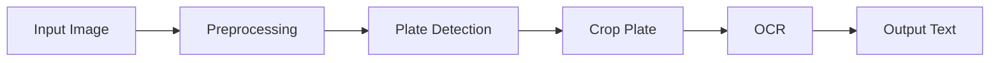

# 🚗 License Plate Detection v2


An AI-powered project for **detecting vehicle license plates and extracting text** using computer vision and OCR techniques.

---

## 🎯 Overview

This project implements an **Automatic License Plate Recognition (ALPR)** system that:

- Detects license plates from images
- Extracts text using OCR
- Outputs results with bounding boxes and plate numbers

Such systems typically combine **object detection + OCR pipelines** for full automation :contentReference[oaicite:0]{index=0}

---

## ✨ Features

- 🔍 License plate detection from images  
- 🧠 Text extraction using OCR  
- 📦 Bounding box visualization  
- ⚡ Efficient and simple pipeline  
- 🧩 Easy to modify and extend  

---

## 🛠️ Tech Stack

- **Python**
- **OpenCV**
- **NumPy**
- **OCR:** Tesseract / EasyOCR  
- **Model:** Haar Cascade / Deep Learning (if used)

---

## 📂 Project Structure

```
License_Plate_Detectionv2/
│── images/              # Input images
│── output/              # Results
│── models/              # Detection models
│── main.py              # Main script
│── utils.py             # Helper functions
│── requirements.txt     # Dependencies
│── README.md
```

---

## ⚙️ Installation

### 1️⃣ Clone Repository
```bash
git clone https://github.com/sauvik-codez/License_Plate_Detectionv2.git
cd License_Plate_Detectionv2
```

### 2️⃣ Create Virtual Environment (optional)
```bash
python -m venv venv
source venv/bin/activate     # Mac/Linux
venv\Scripts\activate        # Windows
```

### 3️⃣ Install Dependencies
```bash
pip install -r requirements.txt
```

---

## ▶️ Usage

### Run the Project
```bash
python main.py
```

### Steps:
1. Load input image  
2. Detect license plate  
3. Draw bounding box  
4. Extract plate region  
5. Apply OCR  
6. Display result  

---

## 📊 Example Output

```
Detected Plate: MH12AB1234
Confidence: 90%
```

---

## 🖼️ Demo

> Add screenshots here for better presentation

```markdown

```

---

## 🔄 Workflow



---

## 🚀 Future Improvements

- 🔹 Real-time video detection  
- 🔹 Improve OCR accuracy  
- 🔹 Train custom deep learning model  
- 🔹 Deploy as web app (Flask / Streamlit)  

---

## 🤝 Contributing

Contributions are welcome!

```bash
git checkout -b feature-name
git commit -m "Added new feature"
git push origin feature-name
```

Open a Pull Request 🚀

---

## 📜 License

This project is licensed under the MIT License.

---

## 👨‍💻 Author

**Sauvik**  
🔗 https://github.com/sauvik-codez  

---

## ⭐ Support

If you like this project, give it a ⭐ on GitHub!
